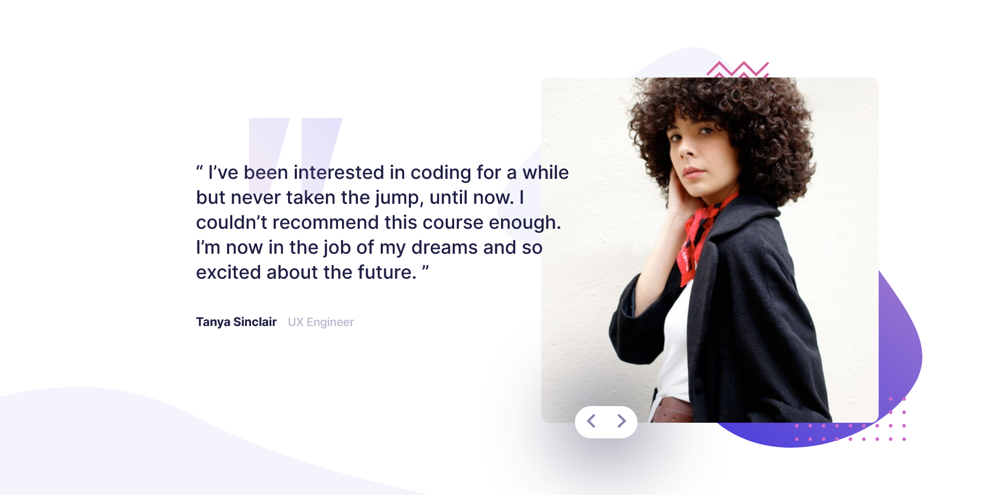

# Frontend Mentor - Coding bootcamp testimonials slider solution

This is a solution to the [Coding bootcamp testimonials slider challenge on Frontend Mentor](https://www.frontendmentor.io/challenges/coding-bootcamp-testimonials-slider-4FNyLA8JL). Frontend Mentor challenges help you improve your coding skills by building realistic projects.

## Table of contents

- [Overview](#overview)
  - [The challenge](#the-challenge)
  - [Screenshot](#screenshot)
  - [Links](#links)
- [My process](#my-process)
  - [Folder structure](#folder-structure)
  - [Built with](#built-with)
  - [What I learned](#what-i-learned)
  - [Continued development](#continued-development)
  - [Useful resources](#useful-resources)
- [Author](#author)

## Overview

### The challenge

Users should be able to:

- View the optimal layout for the component depending on their device's screen size
- Navigate the slider using either their mouse/trackpad or keyboard

### Screenshot

### Links

- Solution URL: [Solution site](https://www.frontendmentor.io/solutions/responsive-slider-built-with-next-sass-react-css3-2n7vert7ri)
- Live Site URL: [Live site](https://hrk-berserker27.github.io/Coding-bootcamp-testimonials-slider-master/)

## My process

### Folder structure

- Created the basic file structure for NextJS projects with creating a pages folder and adding index.js, \_app.js and \_document.js files in it.
- Then created a public folder and dumped all the images and design files in it.
- Created a styles folder and added \_design.scss partial sass file and styles.scss which is the main stylesheet.
- Added .gitignore file and created a package.json file in root directory.

### Built with

- Semantic HTML5 markup
- CSS custom properties
- Flexbox
- Mobile-first workflow
- SASS/SCSS
- [React](https://reactjs.org/) - JS library
- [Next.js](https://nextjs.org/) - React framework

### What I learned

I learned how to use images optimization in NextJS and worked on my CSS skills.

### Continued development

- Responsive part needs work as it is not working as expected on all screen sizes.
- Working on CSS part to reduce the amount of unnecessary code.
- Building this project took again over 4 hrs. It is less than previous solution which I worked with but I time reduction is very important for better productivity, so this needs work.

### Useful resources

- [Images API in NextJS](https://nextjs.org/docs/api-reference/next/image) - This helped me use Image component in NextJS and use various properties associated with it.
- [Issues with Optimized images](https://nextjs.org/docs/api-reference/next/image#unoptimized) - This helped in solving the error with optimized images in static pages in NextJS.
- [Image optimization in NextJS](https://nextjs.org/docs/basic-features/image-optimization#local-images) - This is an amazing article which helped me finally understand Image optimization in NextJS. I'd recommend it to anyone still learning this concept.
- [Learned the difference between Virtual DOM and Incremental DOM](https://blog.bitsrc.io/incremental-vs-virtual-dom-eb7157e43dca) - This is a great article for learning the difference between Virtual DOM in React and Incremental DOM in Angular.

## Author

- Hritick Bhushan
